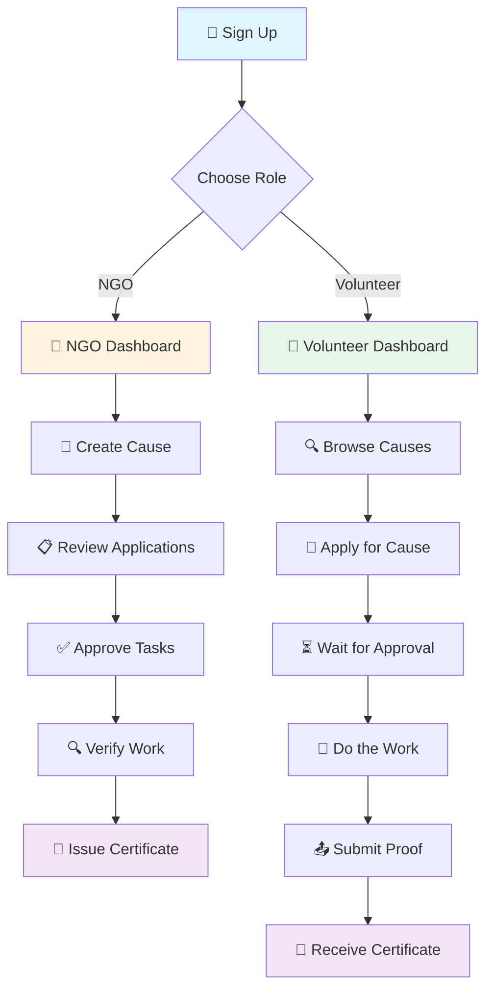

# 🤝 Care-Connect

<div align="center">


### **Bridging the gap between NGOs and Volunteers**

*A platform where compassion meets action* 💚

[](https://github.com)
[](https://github.com)
[](https://github.com)

---

</div>

## 🌟 About Care-Connect

> **Care-Connect** is a platform that brings NGOs (non-profit organizations) and Volunteers together. Think of it like a job board, but for volunteering.

<table>
<tr>
<td width="50%">

### 🏢 NGOs
Organizations that need help
- Animal shelters
- Education charities
- Health organizations
- Environmental groups

</td>
<td width="50%">

### 🙋 Volunteers
People who want to help
- Donate time
- Donate money
- Make an impact
- Build community

</td>
</tr>
</table>

---

## 🔄 How It Works

### 🗺️ The Journey


---

## 📖 Step-by-Step Guide

### **1. 🔐 Signing Up**

<details>
<summary><b>Click to expand</b></summary>

Anyone can create an account by choosing whether they're an NGO or a Volunteer.

**Security Features:**
- ✅ Passwords are scrambled (hashed) before being saved
- ✅ Nobody—not even the system—can read the original password
- ✅ When sending user info back, the password is always stripped out for safety

</details>

---

### **2. 📝 NGO Creates a Cause**

<details>
<summary><b>Click to expand</b></summary>

An NGO posts a "cause" like:
- 🌊 "Beach Cleanup in Mumbai"
- 📚 "Teach Kids English in Delhi"

**What they fill in:**

| Field | Description |
|-------|-------------|
| 📌 Title | Name of the cause |
| 📄 Description | Details about the work |
| 🏷️ Category | Environment, Education, Health, etc. |
| 📍 Location | City, state |
| ⚡ Urgency | 1–10 scale |
| 📅 Duration | Start and end dates |

**Behind the scenes:**
- 🗺️ The location is automatically looked up on a free map service to get exact coordinates
- 📍 This allows causes to show up on a map later

</details>

---

### **3. 🔍 Volunteers Browse Causes**

<details>
<summary><b>Click to expand</b></summary>

Volunteers see all available causes on their dashboard.

**Browse Options:**
- 🔎 Search by location
- 🏷️ Filter by category
- 📊 Switch between **grid view** and **map view**
- 🗺️ View causes with coordinates as pins on an interactive map

**📈 Personal Impact Summary shows:**

<table>
<tr>
<td align="center">🕐</td>
<td><b>Total Volunteer Hours</b></td>
</tr>
<tr>
<td align="center">🎯</td>
<td><b>Causes Supported</b></td>
</tr>
<tr>
<td align="center">💰</td>
<td><b>Money Donated</b></td>
</tr>
<tr>
<td align="center">📊</td>
<td><b>Charts & Graphs</b></td>
</tr>
</table>

</details>

---

### **4. 📨 Applying for a Cause**

<details>
<summary><b>Click to expand</b></summary>

When a volunteer finds something they care about:
```
Step 1: Click "Apply Now" 👆
         ↓
Step 2: Pick available dates 📅
         ↓
Step 3: Submit application ✉️
         ↓
Step 4: Task created! 🎉
```

</details>

---

### **5. 👀 NGO Reviews Applications**

<details>
<summary><b>Click to expand</b></summary>

The NGO sees all incoming applications in their dashboard.

**Application Status:**

| Status | Icon | Action |
|--------|------|--------|
| Under Review | 🔍 | Thinking about it |
| Approved | ✅ | You're in! |
| Declined | ❌ | Sorry, not this time |

</details>

---

### **6. 💪 Volunteer Does the Work**

<details>
<summary><b>Click to expand</b></summary>

Once approved:
- ✅ Volunteer sees the task as **"Upcoming"**
- ⏳ When they start, they mark it **"In Progress"**
- 📅 Their schedule shows up on a **color-coded calendar**

**Calendar Color Codes:**

🟢 **Green** - Completed tasks  
🟡 **Yellow** - In-progress tasks  
🔵 **Blue** - Upcoming tasks  
🔴 **Red** - Overdue tasks

</details>

---

### **7. 📤 Submitting Proof**

<details>
<summary><b>Click to expand</b></summary>

When the work is done:
- 📸 Volunteer submits a link as proof
- 🔗 Could be a photo, Google Drive folder, or document

> ⚠️ **Important:** This does NOT automatically mark the task as finished. NGO still needs to verify it.

</details>

---

### **8. ✅ NGO Approves the Work**

<details>
<summary><b>Click to expand</b></summary>

The NGO reviews the proof and clicks **"Approve Work"**

**Outcomes:**

✅ **Task Completed:**
- Task is officially completed
- Volunteer's hours are counted

❌ **No Show:**
- Volunteer didn't participate
- Task is cancelled

</details>

---

### **9. 📜 Getting a Certificate**

<details>
<summary><b>Click to expand</b></summary>

Once a task is approved, volunteer can download a **PDF certificate**

**Certificate includes:**

<table>
<tr><td>👤</td><td>Volunteer's name</td></tr>
<tr><td>🎯</td><td>Cause they helped with</td></tr>
<tr><td>🏢</td><td>NGO's name</td></tr>
<tr><td>📅</td><td>Dates and total hours</td></tr>
<tr><td>✅</td><td><b>"Verified by NGO"</b> stamp</td></tr>
</table>

This proves it's legitimate!

</details>

---

### **10. 💰 Donations**

<details>
<summary><b>Click to expand</b></summary>

Volunteers can donate money to any cause directly from the cause details page.

**NGOs can track:**
- 💵 Donation totals
- 📈 Donation trends in analytics

</details>

---

### **11. 🌐 Community Feed**

<details>
<summary><b>Click to expand</b></summary>

A social feed where anyone can:

| Feature | Description |
|---------|-------------|
| 📱 Post Updates | Share your volunteer experiences |
| 📸 Share Media | Upload photos and videos |
| ❤️ Like Posts | Show appreciation |
| 💬 Comment | Engage in discussions |

> It's like a mini social network for the volunteer community!

</details>

---

## 🛡️ Safety & Security

<table>
<tr>
<td width="33%" align="center">

### 🔐 Passwords
Scrambled and never visible  
Even admins can't see them

</td>
<td width="33%" align="center">

### 🚫 Access Control
Users only touch their own stuff  
No unauthorized access

</td>
<td width="33%" align="center">

### 📁 File Security
Triple-layer validation  
Blocks harmful content

</td>
</tr>
</table>

---

### 🔒 Security Features

<details>
<summary><b>Password Protection</b></summary>

- 🔐 Passwords are hashed before storage
- 🚫 Nobody can read the original password
- ✅ Stripped from all API responses

</details>

<details>
<summary><b>Access Control</b></summary>

- 👤 Users can only modify their own data
- 🚫 Volunteers can't edit others' tasks
- 🚫 NGOs can't approve tasks for causes they don't own

</details>

<details>
<summary><b>File Upload Security</b></summary>

**Three-layer validation:**
1. ✅ **File name** - Extension validation
2. ✅ **File type label** - MIME type check
3. ✅ **Actual file contents** - Content inspection

This blocks anything harmful!

</details>

<details>
<summary><b>Session & Database Security</b></summary>

**Session:**
- 🔑 Strong random secret for login sessions
- 🚫 No sensitive data logged or leaked

**Database:**
- 🗄️ Enforced relationships
- 🧹 Automatic cleanup when NGO deletes account
- ✅ Always stays clean and organized

</details>

---

## 📊 The Complete Flow

<div align="center">
```
🏢 NGOs post causes
         ↓
🔍 Volunteers find and apply
         ↓
✅ NGOs approve
         ↓
💪 Volunteers do the work and submit proof
         ↓
🔍 NGOs verify
         ↓
🎉 Volunteers earn hours and certificates
```

### 🌟 Along the way:

💸 **Everyone can donate**  
📢 **Everyone can post updates**  
📈 **Everyone can track their impact visually**

</div>

---

<div align="center">

## 🎯 Impact Summary

<table>
<tr>
<td align="center">

<br><b>Volunteers</b>
<br>Making a difference
</td>
<td align="center">

<br><b>NGOs</b>
<br>Finding help
</td>
<td align="center">

<br><b>Community</b>
<br>Growing together
</td>
</tr>
</table>

---

### Made with ❤️ for volunteers and NGOs everywhere

**Connecting hearts, creating impact, one cause at a time** 🌍✨

---


</div>
